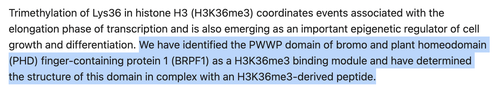
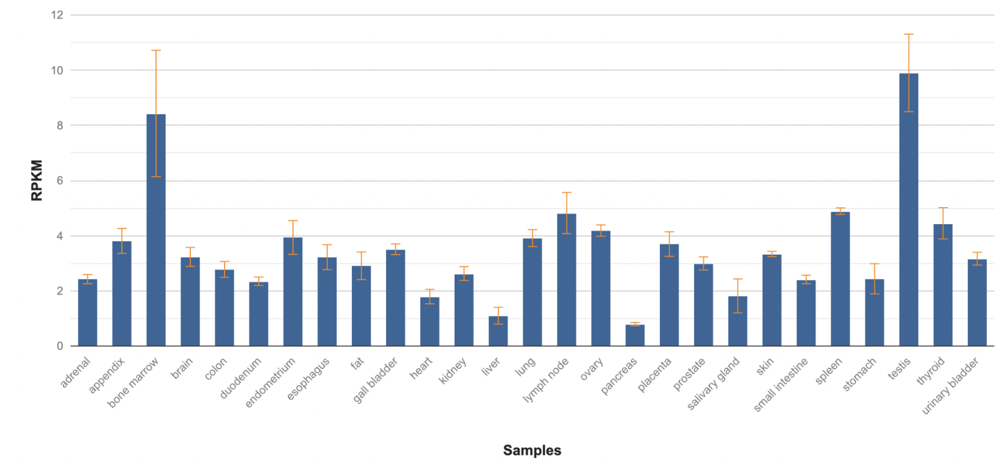
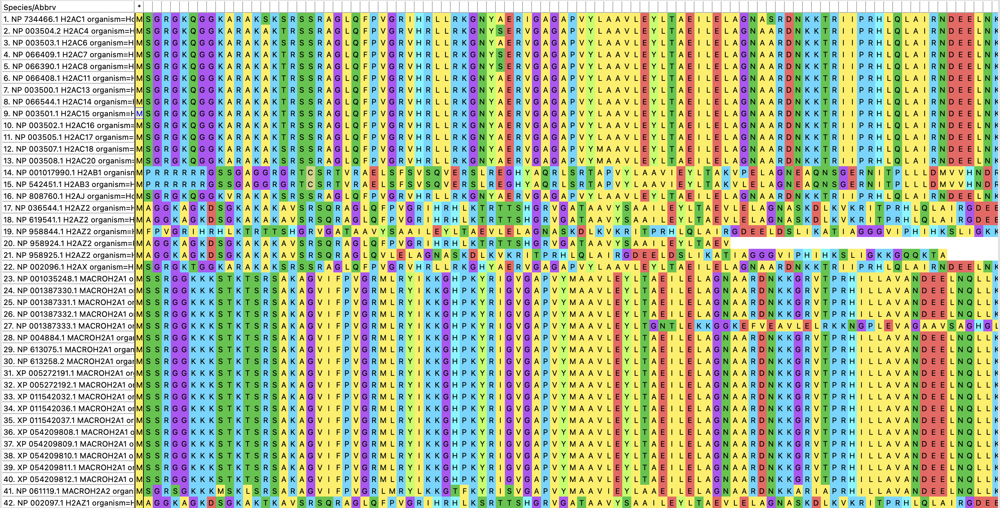
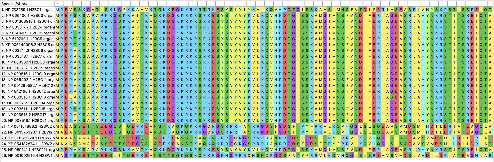
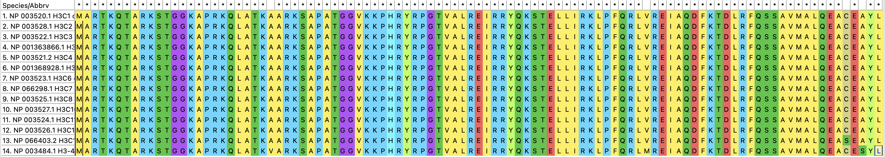
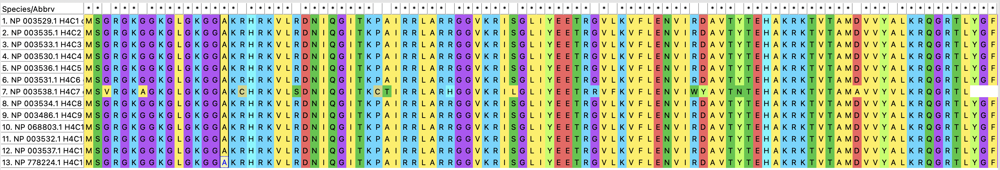
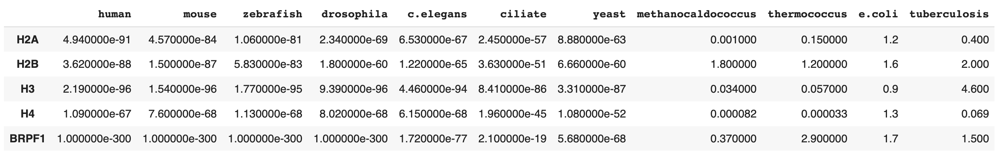
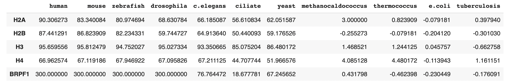
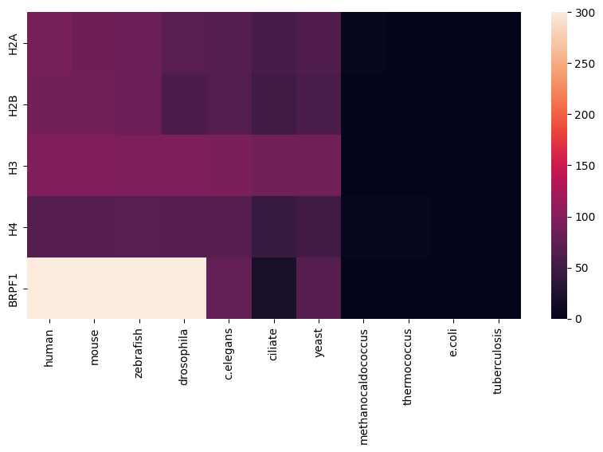

# Проект по биоинформатике

В рамках итогового преокта по биоифнорматике была изучена гистоновая метка **H3K36me** и связанный с ней белок **BRPF1**

## Белок BRPF1

Регулирует образование сосудов в плаценте.  В нервной системе влияет на формирование части коры головного мозга (neocortex) и гипокампа. 

### Связь с H3K36me
Белок связан с гистоновой меткой H3K36me. Это подтверждается многочисленными исследованиями. [Вот одно из них](https://pubmed.ncbi.nlm.nih.gov/20400950/): 

[Вот второе](https://academic.oup.com/nar/article/50/5/2549/6533614)

**Функция:** Histone modification read

**Комплексы:** MOZ/MORF 

**Экспрессия:** Наиболее выражена в костном мозгу, в семенниках

**Доменная структура:** ePHD_BRPF1, COG5141, PWWP_BRPF1, Bromo_brd1_like, SFP1

## Выравнивание гистонов 

Программа для выравнивания: MEGA X

### H2A

Большинство последовательностей очень похожи. Можно сделать вывод, что они кодируют один и тот же белок. Различия же в остальных последовательностях можно объяснить например тем, что хотя все представленные последовательности и выполняют похожие функции, их пространственные структуры различаются. 
### H2B

Как и в предыдущем пункте, большинство последовательностей очень похожи. Можно сделать вывод, что они кодируют один и тот же белок. Различия же в остальных последовательностях можно объяснить например тем, что хотя все представленные последовательности и выполняют похожие функции, их пространственные структуры различаются. 
### H3

Последовательности очень похожи. Можно сделать вывод, что они кодируют один и тот же белок. 
### H4

Последовательности очень похожи. Можно сделать вывод, что они кодируют один и тот же белок. 

## Основная часть 

Для каждого гистона был выбран один образец FASTA-последовательности. Соответствующие файлы приведены в папке data. Там же приведена и последовательность для исследуемого белка BRPF1. 

Работа была проделана локально: сначала с помощью BLASTP был сделан поиск по протеомам, затем была составлена тепловая карта. 

[Ноутбук](https://colab.research.google.com/drive/1a2GypMQp4G139rNSBWdZDplyOnkbL7df)

Метрикой качества найденных хитов был e-value. Для наглядности тепловая карта строилась по `-log10(e-value)`. Таким образом, чем светлее клетка -- тем лучше хит. 

## Результат 

Получили таблицы:

`e-value`: 

`-log10(e-value)`:

По ней построили тепловую карту: 

Можно сделать вывод, что гистоны **H2A**, **H2B**, **H3**, **H4** и белок **BRPF1** возникли в одноклеточных эукариотах и далее закрепились в эволюции. У архей и бактерии они найдены не были. 

Таким образом, мы проделали следующую работу: 

- Произведен анализ белка **BRPF1**. Изучение релевантных исследований показало, что он действительно связан с гистоновой меткой **H3K36me**. Также исследованы его характеристики. 

- Исследованы гистоны **H2A**, **H2B**, **H3**, **H4**. Для каждого произведено выравнивание вариантов последовательностей.

- Произведен поиск гистонов и белка **BRPF1** по организмам различной сложности: многоклеточные позвоночные (human, mouse, zebrafish), многоклеточные беспозвоночные (drosophila, c.elegans),  одноклеточные эукартиоты (ciliate, yeast), археи (methanocaldococcus, thermococcus), бактерии (e.coli, tuberculosis). По полученным резульатам составлена тепловая карта, сделаны соотвествующие выводы. 

